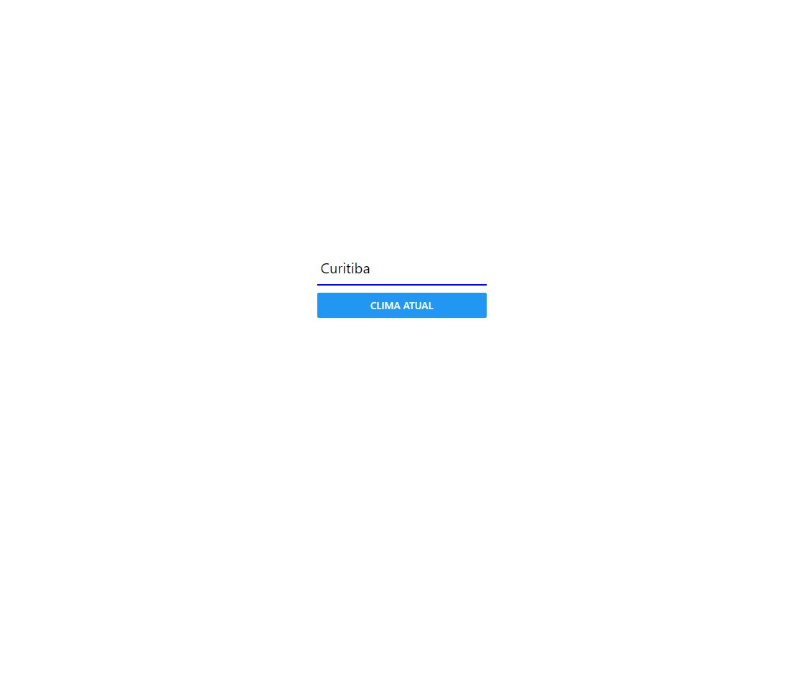
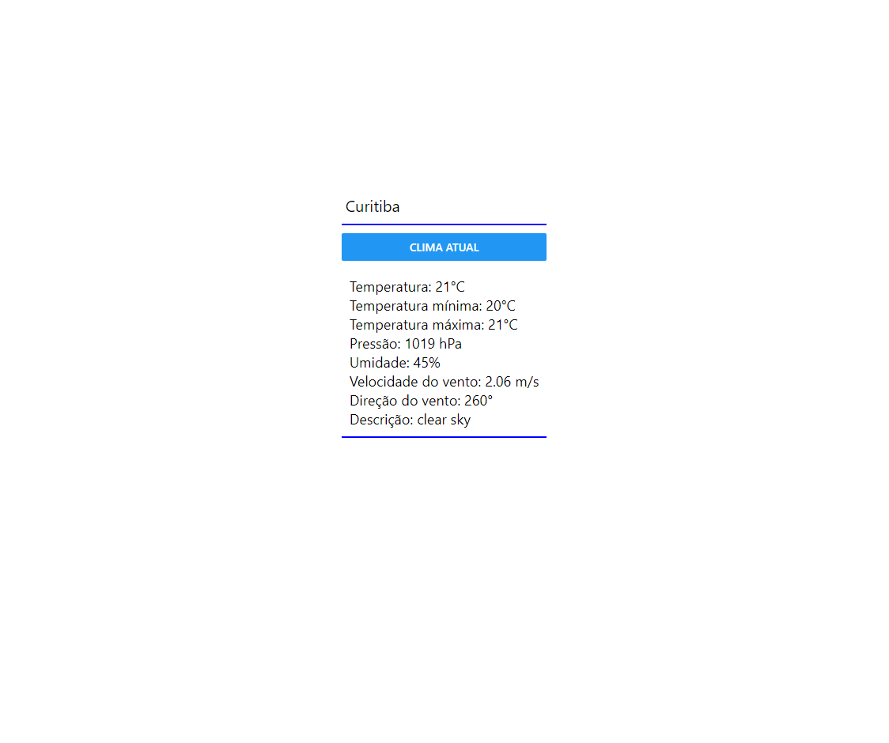

<h2>Atividade 04</h2>

Crie uma View com o consumo de uma API externa (pode ser a TMDB). 
Passe o valor de referência através de um inputText interativo. 

<h2>Clima.js</h2>

<h2>Mostrar Clima</h2>

