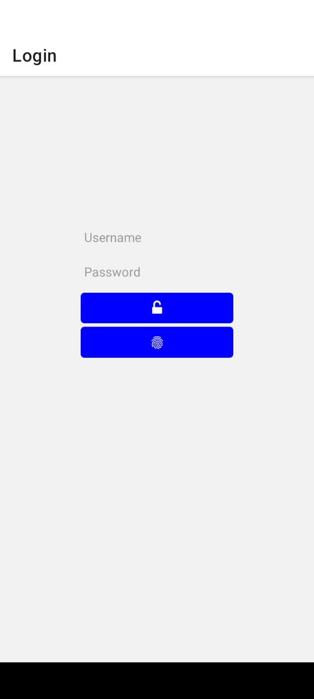
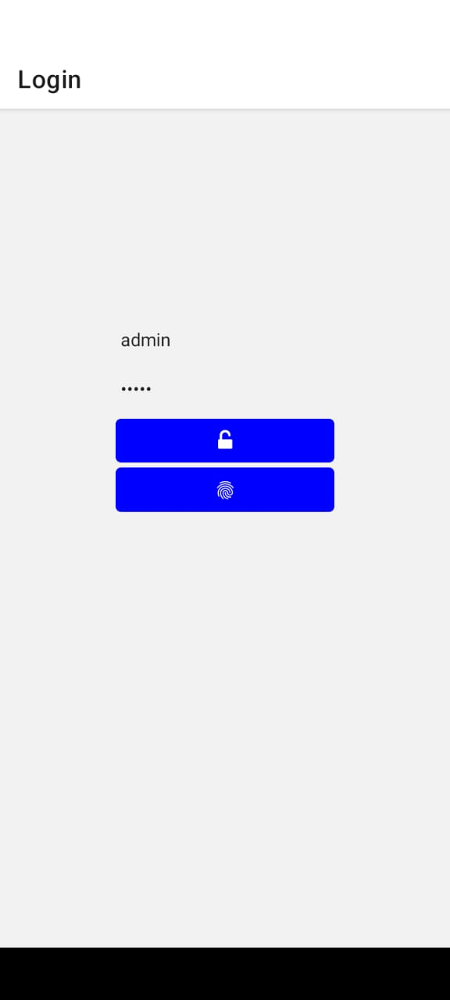
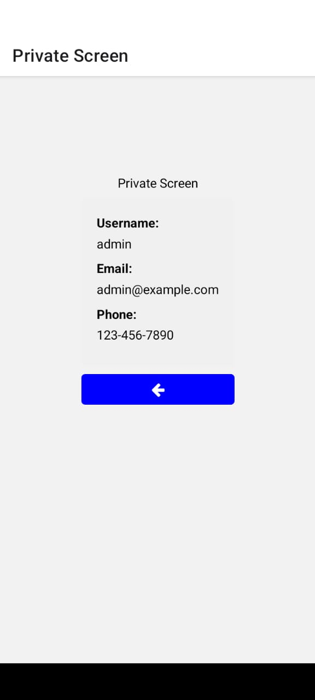
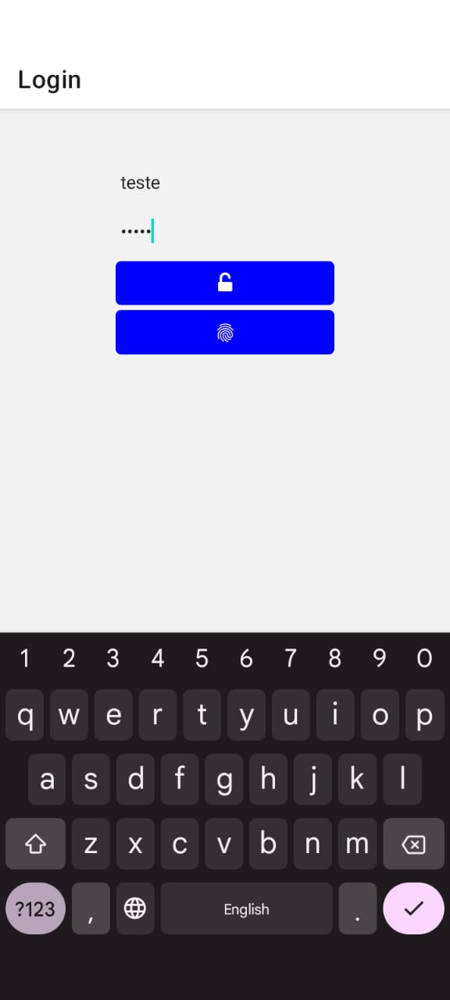
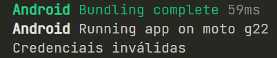
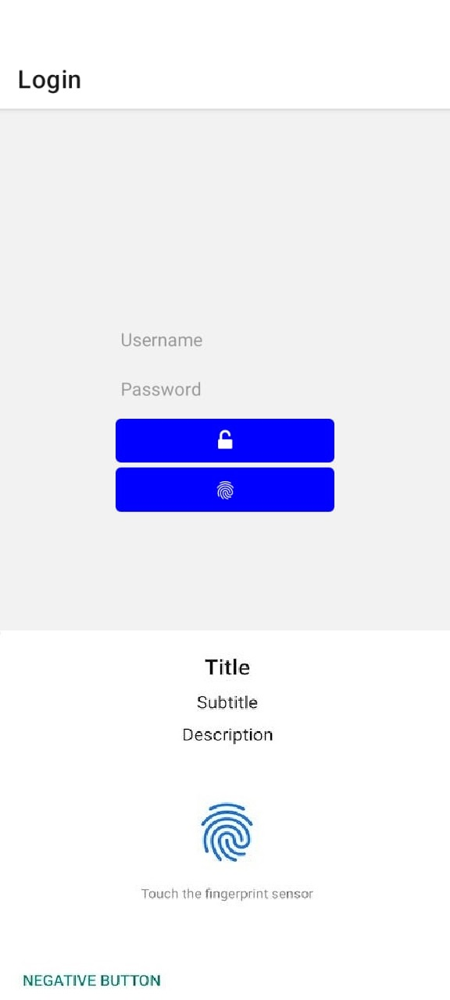

<h2>Atividade 05</h2>

No seu app, faça com que uma view só seja acessível caso o usuário esteja autenticado: 
Seguindo o exemplo de autenticação por impressão digital, exiba um botão de rota no lugar do feedback textual. 

<h2>Tela inicial</h2>

<h2>Login com username e password</h2>

<h2>Private Screen</h2>

<h2>Tentativa de login com credenciais erradas</h2>

<h2>Login com impressão digital</h2>

