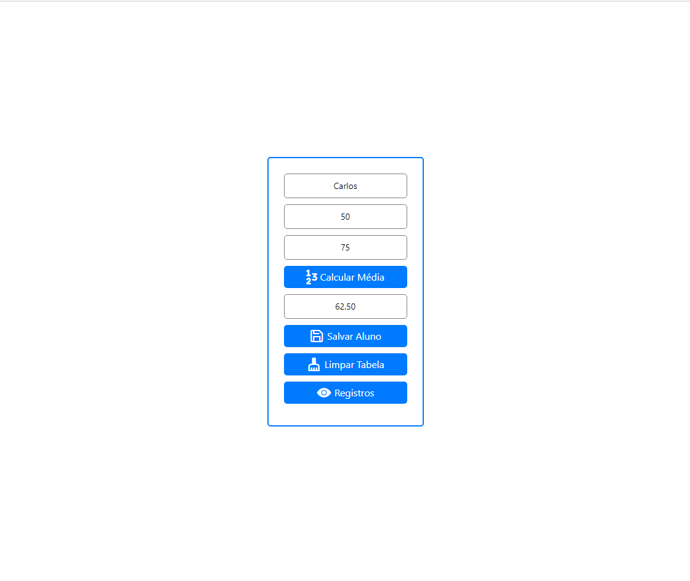
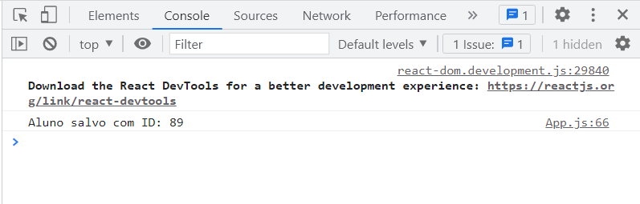
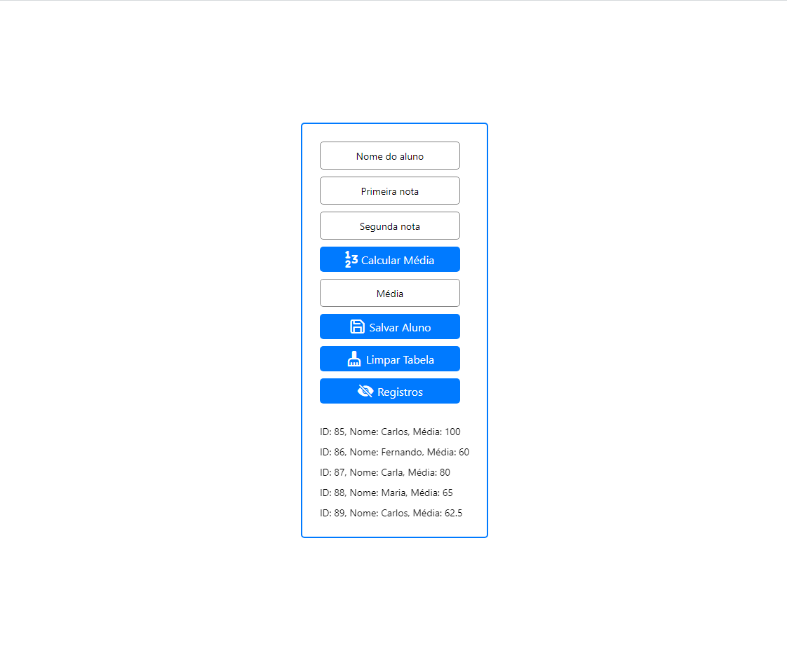
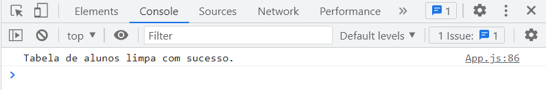

* No seu app no formulário de média das notas de um aluno, acrescente um nome para o aluno e faça com que os dados de média, nome e id sejam gravados em uma base de dados com SQLite. 
* Crie métodos para gravação de novas entradas e exiba(pode ser no console.log) os registros da base de dados.

<h2>Inicial</h2>

<h2>Média</h2>

<h2>Salvar Aluno</h2>

<h2>Registros</h2>

<h2>Limpar Tabela</h2>

