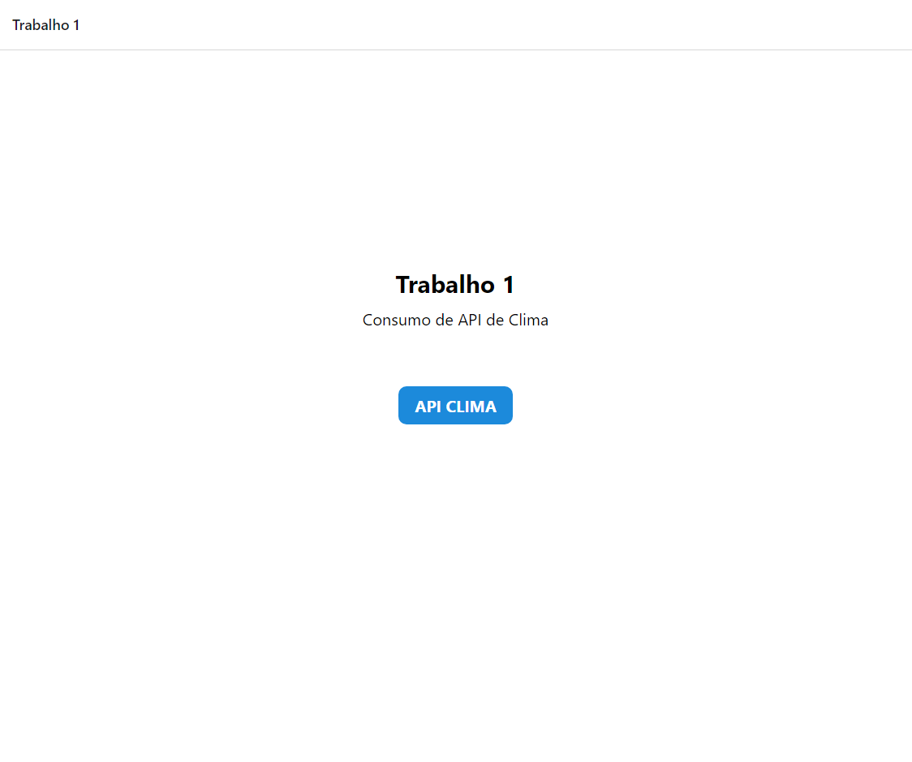
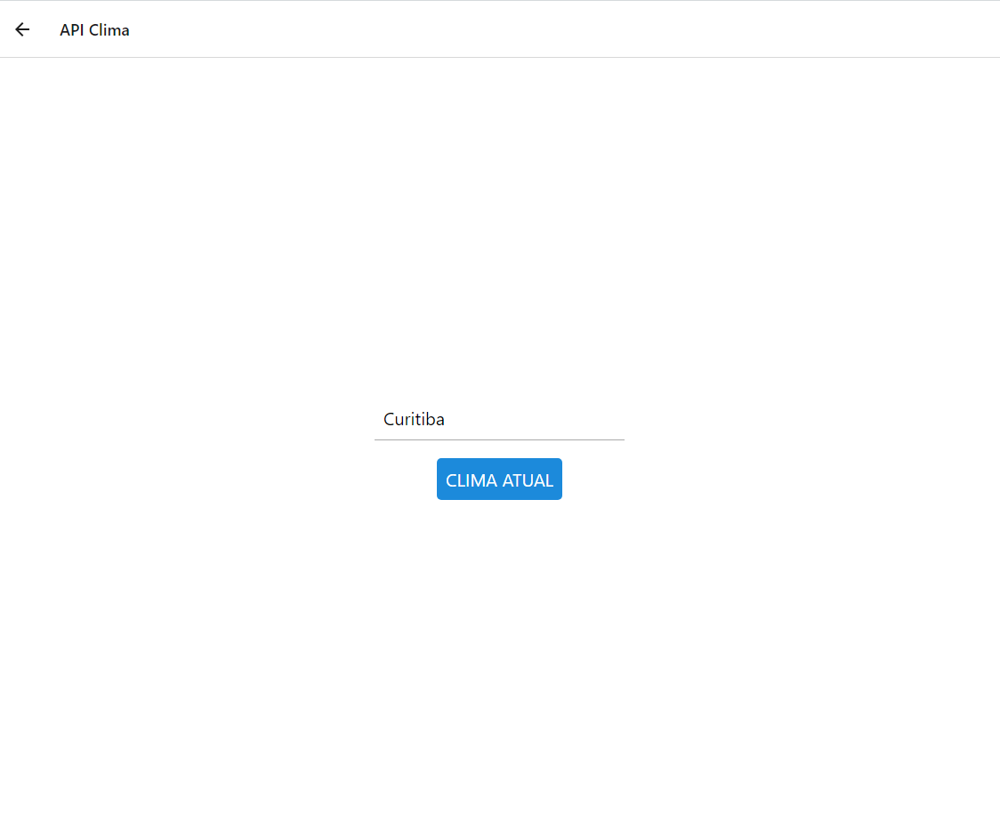
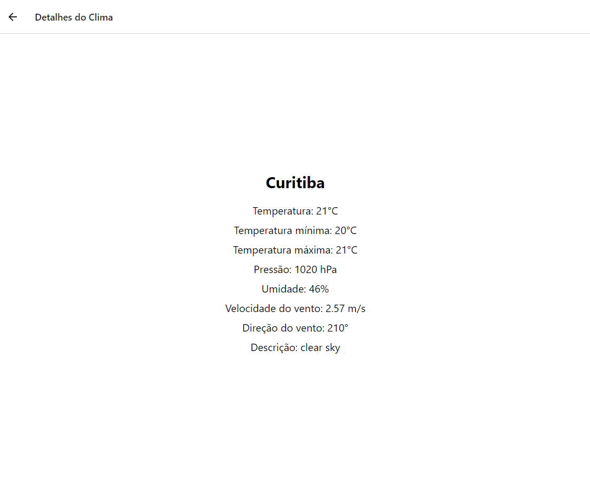

<h2>Trabalho 01</h2>

- Utilize API externa, 
- Consuma esta API e navegue pelos parâmetroscom elementos que aprendemos em aula. 
- Exiba uma navegação e exibição destes dados em 3 camadas

<h2>Home.js</h2>

<h2>Clima.js</h2>

<h2>ClimaDetalhes.js</h2>

