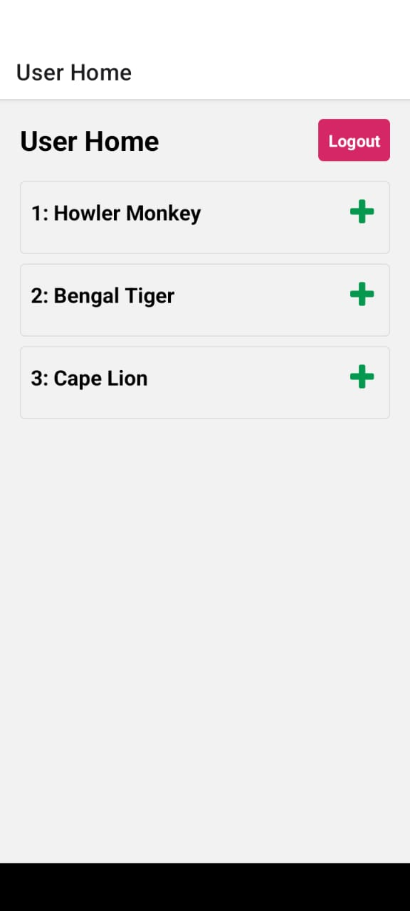

<h2>Trabalho 02</h2>

Especificação do TrabalhoPrático 2.
• Entregar até o fim do dia 27/06/2023 o link para o repositório para dagoncalves@inf.ufpr.br com o assunto DS-151 Nome_Completo; 
• Individual! Os projetos serão analisados e implementações cópia terão a nota zerada. 
1 - Crie uma aplicação de cadastro e controle de informações. Sua aplicação deve utilizar uma API (diferente da usada no trabalho 1) que possua um catálogo de dados que possa ser consumido e mapeado/cadastrado na seguinte estrutura: dado_da_api{id, campo_1, campo_2,..., campo_n} 
2 - Sua aplicação deve iniciar com um processo de autenticação utilizando SQlite, que navegará para uma página de acesso que pode ser administrador ou usuário .Um administrador poderá registrar na base de dados novas entradas consumidas da API e um usuário poderá editar os campos já cadastrados pelo administrador e registrados na base. 
3 - Sua aplicação deverá possibilitar as operações básicas CRUD (Create, Read, Update, Delete) onde um usuário terá uma página que exibe as informações na base de dados através de uma lista e possa alterar as informações. O administrador por sua vez poderá criar e deletar um registro, através da API. 
4 - Você deve tratar erros de conexão com a API, com a base de dados, e do processo de autenticação. Seu código deve estar documentado com as funções e componentes bem definidos e com codificação clara.  

<h2>Tela inicial Admin</h2>

<h2>Adicionar animais com o adminstrador</h2>

<h2>Admin edição de campos</h2>

<h2>Tela inicial User</h2>

<h2>Tela inicial User edição</h2>

<h2>Edição de dados com o User</h2>

<h2>Tela Admin após alteração no User</h2>

<h2>Admin Delete</h2>

